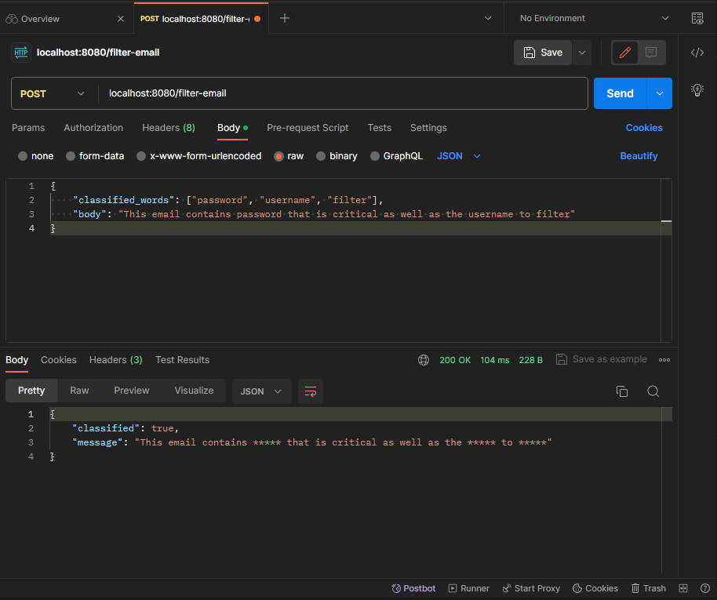
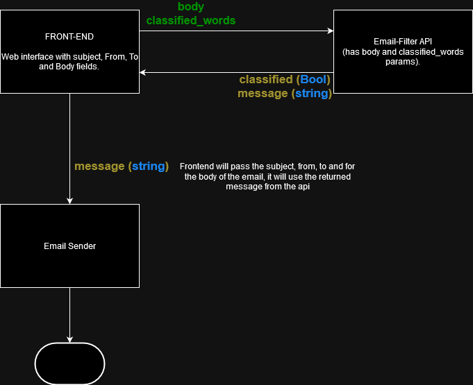

# Email-Filter

An api which scan the email body and look for given confidential words.

## How to start the server

Run the executable file to start the server. You can create the executable file by running `make` command inside the root directory or you can download it to the Github release.

### For Windows
For windows, download the `email-scan.exe` and double click it. It will going to open up a terminal and you will see a `Listening and serving HTTP on :8080`

### For MacOs
For Mac, download the right binary based on your computer's architecture `(email-scan.macos.amd64 or email-scan.macos.arm64)`. Once you download it, make it executable by running this command in the terminal `chmod +x email-scan.macos_amd64` or `chmod +x email-scan.macos_arm64`. After that, you can start the server by running this command in your terminal `./email-scan`.

### For Linux
For Linux, download the `email-scan.linux.amd64` binary and make it executable by doing this command in the terminal `chmod +x email-scan.linux.amd64`. After that, you can start the server by running this command in your terminal `./email-scan`

## Usage

After you successfuly start the server, you can now access the api.

- Base Uri: _**localhost:8080**_
- Method:  _**POST**_
- Route: _**/filter-email**_
- Request Body:
    - _**classified_words**_ : array | list
    - _**body**_ : string

You can use `Postman` to send a request or you can simple use `curl`

### Using Postman

- Click the dropdown and choose `POST` method
- Enter the Base Uri with the Route. It should look like this `localhost:8080/filter-email`
- On the `Body`, choose `raw` and select `JSON`.
- Write your request body in Json format. It should look like this
```
{
    "classified_words": ["password", "username", "filter"],
    "body": "This email contains password that is critical as well as the username to filter"
}
```
- Click send button to send a request to `localhost:8080/filter-email`
- You can see the result below.


### Using Curl

To run it with curl, just copy the command below and change the value of `classified_words` and `body` as you like.

```
curl -X POST -H "Content-Type: application/json" -d '{"classified_words":["password", "username", "filter"],"body":"This email contains password that is critical as well as the username to filter"}' http://localhost:8080/filter-email
```

## How to Implement it to Email System

Since this is an api, we can easily intregrate it to other architecture. We just need to make a request to the api.

On our front-end, we have a website wherein ther are input for Subject, From, To and the body of the email. User will populate it and we will collect all values of that fields. Afterwards, we will make a request to our api (for this example, we hosted our api to localhost) `http://localhost:8080/filter-email` and we will digest the value of `body` from the value we get on our front-end's `body` field. As for `classified_words`, this is usually stored in the environment or the secrets, e.g GCP secret manager, .env or in the environment of the server we are using. So in the front-end, it will require to populate the `classified_words` by pulling it up on the env e.g `os.Getenv("CLASSIFIED_WORDS")`. Once we successfully make a request, the api will return a bool and a string, then we will going to make a request to our emailing system and pass the returned string from the email-filter api.

